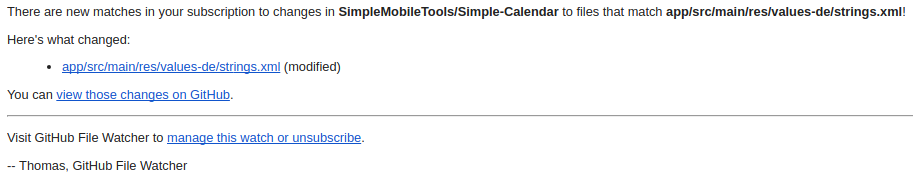

# General-Discussion
A place for discussing all apps in general + anything else you want to say.

FAQ
---
### How do I suggest an improvement, ask a question or report an issue?
If you want to do anything from above, just create a new issue at the [Issues section](https://github.com/SimpleMobileTools/General-Discussion/issues) . Please be constructive and on-topic. In case you are reporting an issue either here, or at some specific app's repository, please give as much useful information as possible, ideally with steps to reproduce. Being able to reproduce a bug and understand it can really speed up the fixing.

### How can I suggest an edit to a file?
Creating pull requests with some changes is a lot simpler than most people think. Most suggestions are related to the translated strings, the steps are as follows:

1. log in to Github
2. find the file with the strings (app/src/main/res/values(-xx)/strings, for example the Italian translation of the Gallery is at https://github.com/SimpleMobileTools/Simple-Gallery/blob/master/app/src/main/res/values-it/strings.xml
3. click the pencil button at the top right corner of the file
4. edit the file with your suggestions*
5. enter a commit message to the first row under the file
6. click `Propose file change`
7. thank yourself!

\* Change only the string which is between ">" and "\</string\>", _not_ the first one after the "name=" tag.

For finding the proper language file at the Gallery go to https://github.com/SimpleMobileTools/Simple-Gallery/blob/master/app/src/main/res, then look for a "values-[language code]" folder. Use the `strings.xml` file inside it. If you can\'t find your language code, the file might not be translated to your language at all yet and you will have to create the whole new file.

### How do I add a new file?
You will most likely want to add a new file only if you translate an app in a new language. Doing it is actually not difficult at all, just read on.

1. log in to Github
2. find the place where the new file belongs. If it's really a translation of the strings in a new language, go to app/src/main/res, for example https://github.com/SimpleMobileTools/Simple-Camera/tree/master/app/src/main/res
3. at the top right corner click at `Create new file`
4. after the `res` folder you can type in your folder path. For creating a German translation just type in `values-de/` (where `de` is the country code). The new folder will be added automatically after typing the slash.
5. add a file name, i.e. `strings.xml`
6. copy the contents of an already existing strings.xml file into the new file (for example the content of https://github.com/SimpleMobileTools/Simple-Camera/blob/master/app/src/main/res/values/strings.xml)
7. add your string translations*
8. add a commit message
9. press `Propose new file`
10. thank yourself!

\* Change only the string which is between ">" and "\</string\>", _not_ the first one after the "name=" tag.

### How can I get notified if a translated file changes?
Sadly Github doesn't have any built in way of setting up notifications/emails when a file changes, but there is a third party service https://app.github-file-watcher.com which seem to work just fine. It sends you an email whenever a new string is added or the watched file changes for whatever reason.
There are 3 fields you have to fill.
1. your email address
2. the repository which contains the target file, here is a list of the repositories. It appears that you will have to fill in the forms for every repository one by one, batch adding doesn't seem to be supported.  

    SimpleMobileTools/Simple-App-Launcher  
    SimpleMobileTools/Simple-Calculator  
    SimpleMobileTools/Simple-Calendar  
    SimpleMobileTools/Simple-Camera
    SimpleMobileTools/Simple-Contacts  
    SimpleMobileTools/Simple-Draw  
    SimpleMobileTools/Simple-File-Manager  
    SimpleMobileTools/Simple-Flashlight  
    SimpleMobileTools/Simple-Gallery  
    SimpleMobileTools/Simple-Music-Player  
    SimpleMobileTools/Simple-Notes  
    SimpleMobileTools/Simple-Thank-You  

    SimpleMobileTools/Simple-Commons (for this repository the file path in the next step will be different)

3. the file path. For all regular apps the path will be `app/src/main/res/values-xx/strings.xml`, replacing `xx` with your language code. For `Simple-Commons` repository the path begins with `commons`, making it `commons/src/main/res/values-xx/strings.xml`.

If you've setup everything properly, you should get a confirmation email for every repository. Then, whenever a file changes, you will get an email about it. The email will arrive only a couple hours after the actual file has been changed, but it's still good enough.

This is a sample email, that you will receive once a file changes, in this example I'm using the German translation of the Calendar app.  

You can see that it contains multiple clickable links, let's describe them from the bottom. The first one is for easy unsubscribing, when you don't want to watch the file anymore.  
The middle one contains a link to the specific commit, which changed the file. If you search for "values-de", you can easily see what exactly changed.  
The link at the top points to the new version of the file, created by the commit. It points to a side branch though, you will have to switch to the master branch. It's really easy, just look at the part above the file and look for a `Tree: xxxx` button, as seen on this screenshot.

Click on it, then select `master`. You will be redirected to the latest version of the file, which you can already edit by pressing the pencil, as described [here](https://github.com/SimpleMobileTools/General-Discussion#how-can-i-suggest-an-edit-to-a-file).
